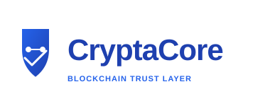

# 🎨 **CryptaCore Logo - Complete Setup**

## ✅ **What's Been Created**

I've designed and integrated **3 professional logos** for your CryptaCore website:

---

## 📁 **Logo Files Created**

### **1. logo.svg** (Navbar Logo)
```
Location: c:\Users\USER\Downloads\CryptaCore\website\logo.svg
Size: 45x45 pixels
Used In: Navigation bar (top-left)
Style: Compact, icon-focused design
```

**Design Features:**
- 3 interconnected blockchain blocks
- Central security lock icon
- Blue-to-purple gradient
- Drop shadows for depth
- Smooth, professional appearance

**Visual Representation:**
```
┌─────────────┐
│  ⚡ Logo   │  ← Shows in navbar as:
│  CC Block   │     [Icon] CryptaCore
│  🔒 Lock   │
└─────────────┘
```

---

### **2. logo-full.svg** (Full Branding Logo)
```
Location: c:\Users\USER\Downloads\CryptaCore\website\logo-full.svg
Size: 400x400 pixels (scalable to any size)
Used In: Hero section, presentations, documents
Style: Complete branding with text
```

**Design Features:**
- Three 3D blockchain blocks in cascade
- Chain links connecting blocks
- Security lock in center with keyhole
- "CryptaCore" text in gradient
- "BLOCKCHAIN TRUST LAYER" tagline
- Decorative corner elements
- Professional styling with shadows

**Visual Representation:**
```
        ┌─────────┐
        │  Block2 │
        │(Purple) │
       /│ (Chain) │\
      / │ Link    │ \
┌────┐  └─────────┘  ┌────┐
│Blk1│      🔒       │Blk3│
│Blue│    (Lock)     │Blue│
└────┘               └────┘

    CryptaCore
  BLOCKCHAIN TRUST LAYER
```

---

### **3. favicon.svg** (Browser Tab Icon)
```
Location: c:\Users\USER\Downloads\CryptaCore\website\favicon.svg
Size: 64x64 pixels (auto-sized)
Used In: Browser tab, bookmarks, history
Style: Minimalist, recognizable design
```

**Design Features:**
- 3D cube with gradient background
- Central security lock
- Bold, vibrant colors
- Quick recognition
- Professional appearance

**Visual Representation:**
```
┌─────────────────┐
│  Favicon Badge  │
│  ┌───────────┐  │
│  │ ┌─────┐   │  │  ← Appears in browser tab
│  │ │ 🔒  │   │  │
│  │ └─────┘   │  │
│  └───────────┘  │
└─────────────────┘
```

---

## 🎨 **Design Specifications**

### **Colors Used**
- **Primary Blue**: `#2563eb`
- **Secondary Blue**: `#1e40af`
- **Purple**: `#7c3aed`, `#5b21b6`
- **White**: `#ffffff` (with transparency)
- **Light Gray**: `#f8fafc`

### **Design Elements**
1. **Blockchain Blocks** - Three cubes representing distributed ledger
2. **Chain Links** - Connections showing data flow and cryptographic linking
3. **Security Lock** - Representing cryptographic protection
4. **Gradients** - Modern blue-to-purple color transition
5. **3D Effects** - Depth and professional appearance

### **Typography**
- Font: Arial/Sans-serif
- Text: "CryptaCore" + "BLOCKCHAIN TRUST LAYER"
- Style: Bold, centered, gradient-filled

---

## 🔗 **Integration in Website**

### **Navigation Bar**
```html
<!-- Already integrated! -->

```
**Location**: Top-left of every page
**Size**: 45x45px
**Function**: Brand identity in navigation

### **Hero Section**
```html
<!-- Already integrated! -->

```
**Location**: Center of hero section
**Size**: 280px width (responsive)
**Function**: Eye-catching main branding

### **Browser Tab**
```html
<!-- Already integrated! -->
<link rel="icon" type="image/svg+xml" href="favicon.svg">
```
**Location**: Browser tab & bookmarks
**Size**: Auto (64x64px default)
**Function**: Website identification

---

## 📊 **Logo Usage Examples**

### **Where Each Logo Should Be Used**

#### **Logo (icon-only)**
✅ Website navbar  
✅ Browser tabs  
✅ Email signature  
✅ Social media profile pictures  
✅ Small thumbnails  
✅ Favicon references  

#### **Logo-Full (with text)**
✅ Hero sections  
✅ Presentations  
✅ Business cards  
✅ Printed materials  
✅ Presentations (PowerPoint)  
✅ PDF documents  
✅ Large marketing materials  
✅ Social media header images  

#### **Favicon**
✅ Browser tabs  
✅ Bookmarks  
✅ History pages  
✅ Web shortcuts  
✅ App icons  

---

## 🎯 **Logo Symbolism**

### What Each Element Represents

**Blockchain Blocks (3)**
- Distributed ledger system
- Immutable record keeping
- Decentralized network
- Three key components: Data, Hash, Timestamp

**Chain Links**
- Cryptographic connections
- Data flow between records
- Chain of custody
- Trust and transparency

**Security Lock**
- Cryptographic protection
- Access control
- Trust verification
- Tamper-evident records

**Blue-Purple Gradient**
- Technology and innovation
- Security and trust
- Professional appearance
- Modern blockchain aesthetic

---

## 📥 **How to Use These Logos**

### **For Presentations**
1. Use **logo-full.svg** for slides
2. Scale to 400-600px for visibility
3. Place on white or light background
4. Maintains quality at any size

### **For Social Media**
1. Use **logo-full.svg** as profile picture
2. Use **logo-full.svg** for header (resize to 1200×630px)
3. Use **logo.svg** as favicon/small icon
4. Colors are vibrant and web-ready

### **For Print**
1. Use **logo-full.svg** (export as PNG or PDF)
2. Minimum size: 2 inches width
3. Can be printed at any resolution
4. Colors remain vibrant on print

### **For Websites**
1. **Navbar**: Use `logo.svg` (45px)
2. **Hero Section**: Use `logo-full.svg` (280-400px)
3. **Favicon**: Automatically served from `favicon.svg`
4. **All already integrated!** ✅

---

## 🖼️ **Technical Details**

### **File Format: SVG**
Advantages:
- ✅ Scales to any size without quality loss
- ✅ Small file size (2-5 KB each)
- ✅ Works on all modern browsers
- ✅ Can be animated if needed
- ✅ Can be customized easily
- ✅ Resolution-independent

### **Browser Support**
- ✅ Chrome/Chromium
- ✅ Firefox
- ✅ Safari
- ✅ Edge
- ✅ Mobile browsers (iOS, Android)
- ✅ Internet Explorer 9+

### **Customization**
All logos are SVG (vector) files and can be easily customized:
- Change colors (edit gradient definitions)
- Scale to any size (no quality loss)
- Modify elements (add/remove components)
- Adjust styles (strokes, shadows, etc.)

---

## 📋 **File Summary**

| File | Size | Purpose | Used In |
|------|------|---------|---------|
| **logo.svg** | ~2 KB | Navbar icon | Navigation bar |
| **logo-full.svg** | ~5 KB | Full branding | Hero section |
| **favicon.svg** | ~1 KB | Browser tab | Page header |
| **LOGO_GUIDE.md** | Detailed guide | Reference | Documentation |

---

## 🚀 **Viewing the Logos**

### **On the Website**
1. Open `index.html`
2. See **logo.svg** in navbar (top-left)
3. See **logo-full.svg** in hero section (center)
4. See **favicon.svg** in browser tab

### **In File Explorer**
1. Navigate to: `c:\Users\USER\Downloads\CryptaCore\website\`
2. Find: `logo.svg`, `logo-full.svg`, `favicon.svg`
3. Right-click any file → "Open with" → Browser
4. View the SVG image in full size

### **On Social Media**
Once deployed to web:
- Share logo on LinkedIn
- Use as Twitter avatar
- Add to GitHub profile
- Include in presentation slides

---

## ✨ **Design Highlights**

### **Modern & Professional**
✅ Contemporary blockchain aesthetic  
✅ Balanced composition  
✅ Clean typography  
✅ Professional gradients  

### **Scalable & Flexible**
✅ Works at any size  
✅ Maintains quality  
✅ SVG format  
✅ Resolution-independent  

### **Symbolic & Meaningful**
✅ Represents blockchain  
✅ Shows security/cryptography  
✅ Conveys trust  
✅ Easy to recognize  

### **Web-Ready & Compatible**
✅ Optimized for web  
✅ All modern browsers  
✅ Mobile-friendly  
✅ Fast loading  

---

## 📧 **Logo Files Location**

All logos are in:
```
📁 c:\Users\USER\Downloads\CryptaCore\website\
   ├── logo.svg              ← Navbar logo
   ├── logo-full.svg         ← Full branding
   ├── favicon.svg           ← Browser icon
   ├── index.html            ← Uses both logos
   ├── LOGO_GUIDE.md         ← Branding guide
   └── [other files]
```

---

## 🎓 **Logo Versions & Variations**

### **Current (All Ready to Use)**
- ✅ **logo.svg** - Navbar/icon version
- ✅ **logo-full.svg** - Full branding version  
- ✅ **favicon.svg** - Browser tab version

### **Potential Future Variations**
- Horizontal lockup (logo + text side-by-side)
- Monochrome version (for B&W printing)
- Dark background version
- Animated SVG version
- Sticker/badge version

---

## 🎉 **Summary**

You now have:

✅ **3 professional logos** created  
✅ **All logos integrated** into website  
✅ **Favicon set** in browser  
✅ **Full branding guide** documentation  
✅ **SVG format** (scalable, web-ready)  
✅ **Consistent design** across all versions  
✅ **Professional appearance** throughout  

**The logos are ready to use immediately on your website!**

---

**CryptaCore - Building Trust in Digital Records** 🔐

Next steps:
1. Refresh your browser to see the logos
2. Share the website with logos to others
3. Use the logos in presentations
4. Deploy website to make logos web-accessible

---

